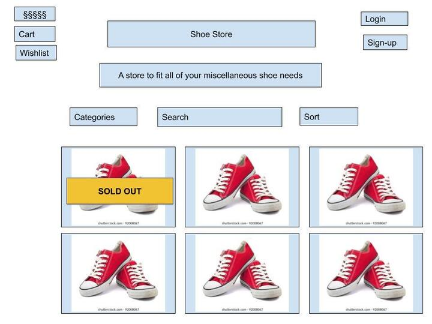

# Shoe Store

[](https://opensource.org/licenses/MIT)

## Description

**Important Update**: This app is no longer deployed on Heroku. Instead you can view the presentation with Demo included [here](https://youtu.be/ph_o2nvQNfA)

Our online Shoe Store is a full-stack e-commerce website that sells many different kinds of shoes. Users can browse our various offerings, sort them by price or stock, and view them in detail on separate pages. Once they create an account and log in, users will be able to take advantage of our Wishlist feature to save their favorite options for later while they decide what they want to ultimately purchase, or perhaps to share with friends or family who are looking for gift ideas. When a logged in user is ready to purchase a pair (or more) of shoes, they can utilize the Cart feature to gather all the items they would like to purchase in one place. Finally, at any time, a user can opt to remove an item for either list on any page of the site. The page will respond dynamically to reflect the change. 

Our team wanted to create this webpage because it is a very practical endeavor to test our understanding and application of all we have learned thus far with respect to creating a full-stack web application. E-commerce has embedded itself in our daily lives and has become a very large part of basically every shopping experience. Having a smoothly operating and easy to navigate website is critical to maintaining customers, closing sales, and generating revenue. It is very likely that our first jobs after this program will have something to do with e-commerce, so this was a great way to put our skills to the test and add a highly relevant project to our portfolios. 

Through working on this project, we learned a lot about utilizing the MVP framework to build a robust and dynamic full-stack application with a polished front end and comprehensive back end. Some of the biggest points of learning include:
* Authentication, sessions, and cookies
* Many-to-Many relationships and bridge tables
* Utilizing POST and DELETE routes to edit the data stored in the database
* Leveraging the ability to store information about the user in the session data
* Using the user's sort choice to pass information to the query to return the desired order of results
* Taking advantage of the flexibility of handlebars to serve up different HTML templates with variable data depending on the situation

## Table of Contents
        
- [User Story](#user-story)
- [Acceptance Criteria](#acceptance-criteria)
- [Installation](#installation-if-you-would-like-to-clone-the-repo-and-work-from-the-backend-otherwise-simply-visit-the-deployed-application)
- [Usage](#usage)
- [Link to Deployed Application](#link-to-deployed-application)
- [Credits](#credits)
- [License](#license)
- [Contributing](#contributing)
- [Tests](#tests)
- [Questions for the Team?](#questions-for-the-team)
- [Initial Wireframe from brainstorming session](#initial-wireframe-from-brainstorming-session)

## User Story
```
AS A consumer
I WANT to be able to browse for shoes based on my preferred criteria and save my favorites
SO THAT I can purchase new shoes
```
## Acceptance Criteria
```
GIVEN an online shopping site for shoes
WHEN I arrive at the homepage
THEN I am presented with a list of shoes for sale including the name of the product, its price, and the amount in stock
WHEN I want to sort the products
THEN I am able to click on a button to sort by price or stock (either low to high, or high to low)
WHEN I click on Cart or Profile in the navigation bar
THEN I am brought to a Login/Signup page in order to sign-in to the website using my email and password, or to create a new account
WHEN I return to the homepage after logging in
THEN I now have the option to add shoes to my cart or my wishlist
WHEN I click on an individual shoe
THEN I am brought to another page that only displays that shoe
WHEN I add shoes to my wishlist
THEN I will be presented with them on my Profile page, even after I log out
WHEN I add shoes to my cart
THEN I will be presented with them on my Cart page, but only until I log out or the session expires (30 minutes)
WHEN I am logged in and visit any page on the website
THEN I will be able to add or remove shoes from my cart or wishlist
WHEN I have already added a shoe to my cart or wishlist
THEN I will see the button "clicked" for that shoe on any page I visit
WHEN I am on the Cart or Profile page and remove a show from that list
THEN I will see the page automatically reload to remove that shoe from view
```
 
## Installation (if you would like to clone the repo and work from the backend; otherwise simply [visit the deployed application](https://mighty-brushlands-95444.herokuapp.com/)) 
1. Install Node.js
    - [Download Version 16 of Node.js](https://nodejs.org/download/release/v16.18.0/node-v16.18.0-x64.msi)
2. Clone this repo
   ```sh
   git clone https://github.com/michael-loeffler/Shoe-Store.git
   ```
3. Install the dependencies included in the package.json
   ```sh
   npm i
   ```
4. Create a .env file with the following information
   ```sh
   DB_NAME='shoe_store_db'
   DB_USER='root'
   DB_PASSWORD='your MySQL password here'
   ```
5. Open MySQL, and run the following commands 
   ```sh
   source db\schema.sql
   quit
   ```
6. Seed the database in the command-line using the following command
   ```sh
   npm run seed
   ```
7. Start the server by using the following command in the command-line
   ```sh
   npm start
   ```
8. Open the site on your local host (e.g., http://localhost:3001/)

## Usage

Our online Shoe Store functions in two primary modes: browsing for the general user, and then a more tailored experience for users who have created an account and logged in. Without logging in, a user can see all the shoes we offer, sort the results to their preference, or see an individual product page. Each page/view sends a specific query to a MySQL database and serve the results to the corresponding handlebars view for that page. A logged in user has the ability to add products to either their cart or wishlist. The wishlist selections are stored in the database via a POST route, so will persist across multiple sessions. The cart data however is attached only to the session, so will disappear whenever a user logs out or the session expires. Finally, all pages will render the buttons to add or remove from the cart or wishlist in their current state, so if an item is already on one or both lists, that button will render as clicked and therefore read "Remove from ____" instead of add. 

## Link to deployed application
[https://mighty-brushlands-95444.herokuapp.com/](https://mighty-brushlands-95444.herokuapp.com/)

## Credits

Node packages used:
  - bcrypt
  - connect-session-sequelize
  - dotenv
  - express
  - express-handlebars
  - express-session
  - mysql2
  - sequelize

## License
    
Covered under the MIT License. For more details and to view the license in full, please visit the [MIT License Webpage](https://choosealicense.com/licenses/mit/).

## Contributing
    
If you have a suggestion for improvement, please fork the repo and create a pull request. You can also open an issue and tag it for "enhancement".
1. Fork the Project
2. Create your Feature Branch (`git checkout -b feature/featureName`)
3. Commit your Changes (`git commit -m 'adds featureName'`)
4. Push to the Branch (`git push origin feature/featureName`)
5. Open a Pull Request
    
## Tests

N/A

## Questions for the Team?
* Cameron Dassow: Please visit my [GitHub profile: cameronjoshua](https://github.com/cameronjoshua) or [email me with questions](mailto:cameronda145@gmail.com)
* Michael Loeffler: Please visit my [GitHub profile: michael-loeffler](https://github.com/michael-loeffler) or [email me with questions](mailto:michaeloeffler23@gmail.com)
* Danielle Torrise: Please visit my [GitHub profile: dltorrise](https://github.com/dltorrise) or [email me with questions](mailto:dltorrise@gmail.com)

## Initial Wireframe from brainstorming session

